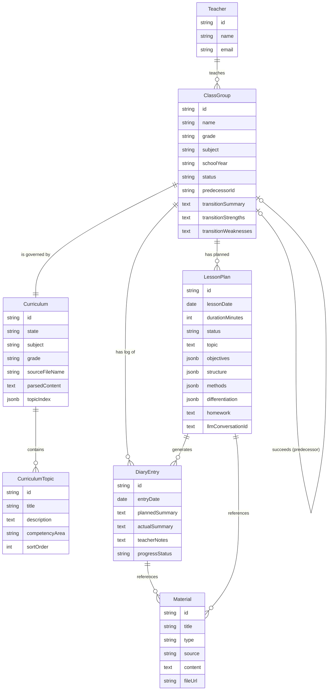
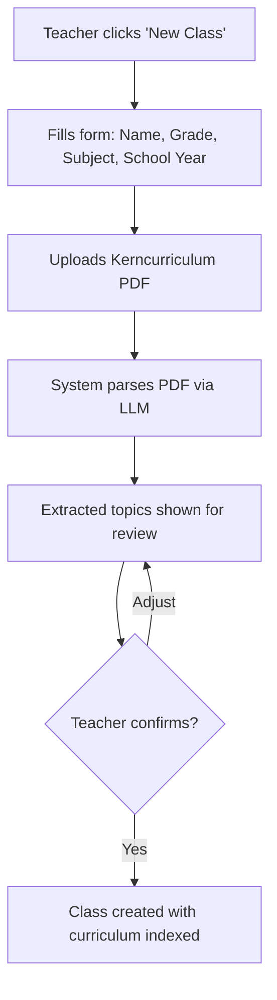
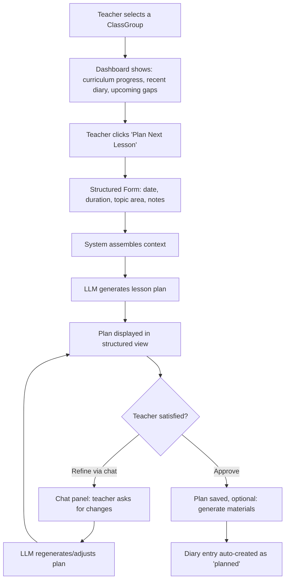
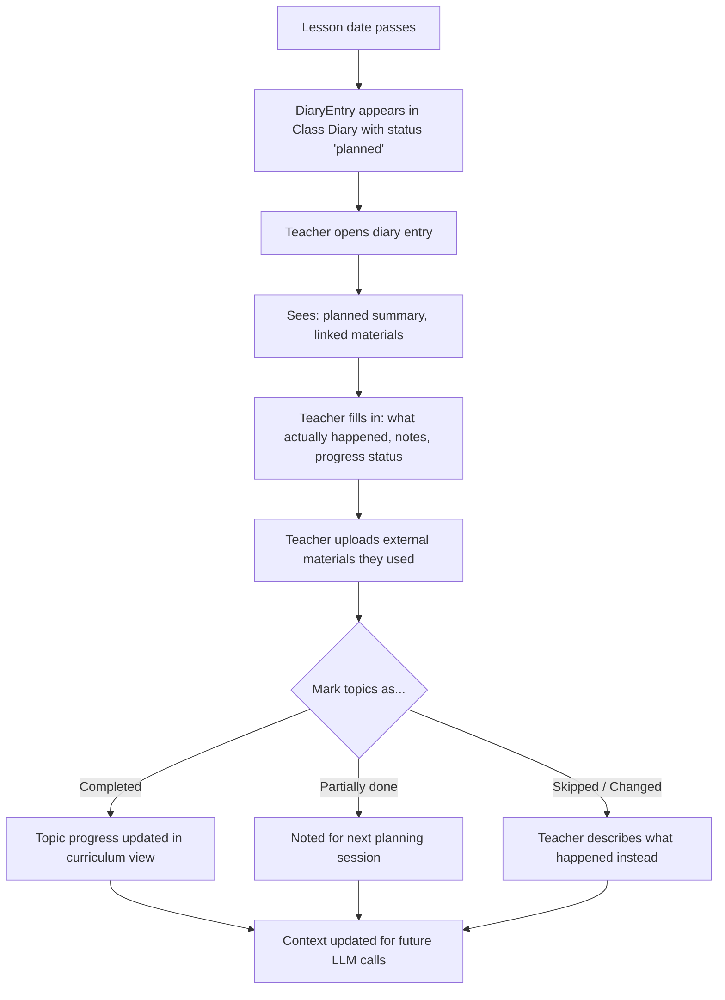
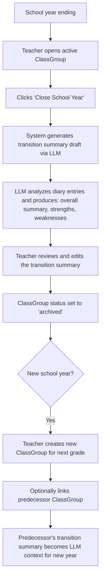
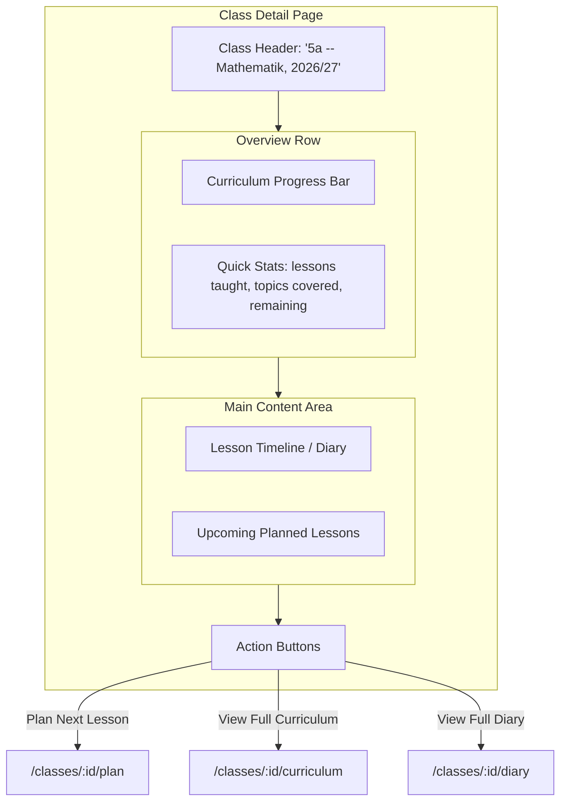
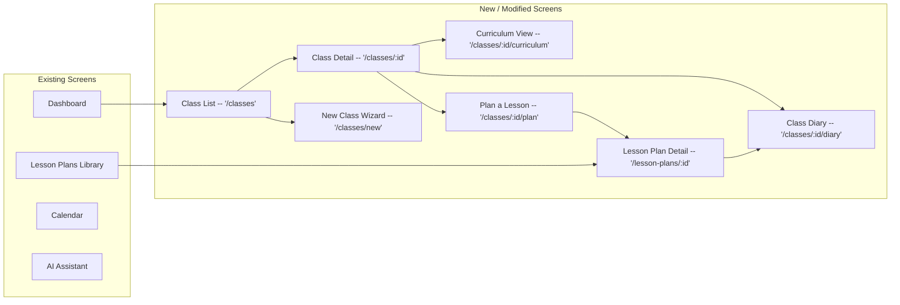
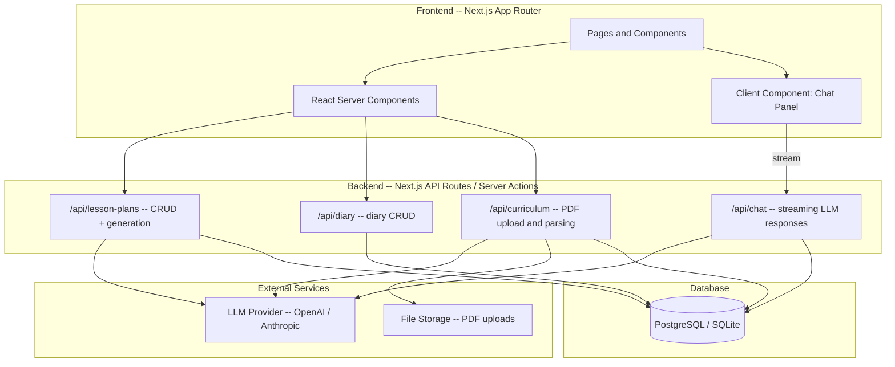
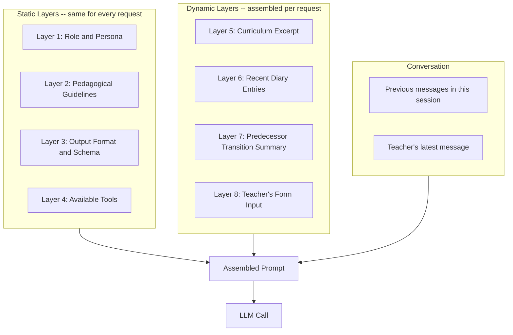

# AI-Assisted Lesson Planning -- Feature Architecture Document

## 1. Feature Summary

Chalkdust's core feature enables teachers to plan individual lessons with LLM assistance. The system uses three layers of context to generate high-quality, relevant lesson plans:

1. **Kerncurriculum** -- the government-mandated curriculum for a specific grade and subject, uploaded as a PDF
2. **Class Diary** -- a living log of what the class has actually done (auto-populated from plans, annotated by the teacher)
3. **Teacher Intent** -- what the teacher wants to cover next, expressed via a structured form + conversational refinement

---

## 2. Domain Model

The core entities and their relationships:




### Key Design Decisions

- **ClassGroup** (not "Class" to avoid reserved word conflicts) ties together a grade, subject, and school year. A teacher teaching "Mathe" to "5a" and "5b" would have two ClassGroups.
- **ClassGroup.status**: `"active"` for the current school year, `"archived"` for previous years. Archived groups are read-only but always accessible.
- **ClassGroup.predecessorId**: Optional link to the previous year's ClassGroup (e.g., "6a Mathe 2027/28" links back to "5a Mathe 2026/27"). This creates a chain across years.
- **ClassGroup transition fields**: `transitionSummary`, `transitionStrengths`, `transitionWeaknesses` are written at end-of-year on the *old* ClassGroup. These capture the teacher's assessment of how the class performed and what to watch for next year. Can be partially LLM-generated from the diary ("Based on your diary, this class excelled at X but found Y challenging").
- **Curriculum** stores both the raw parsed content (for LLM context) and a structured topic index (for the checklist/progress view).
- **DiaryEntry** has both `plannedSummary` (auto-generated from LessonPlan) and `actualSummary` + `teacherNotes` (teacher-editable). This captures the gap between plan and reality.
- **LessonPlan** stores the full structured output plus a reference to the LLM conversation so the teacher can resume refining.
- **Material** has a `source` field distinguishing between `"generated"` (created by the system), `"linked"` (referenced from a lesson plan), and `"uploaded"` (externally uploaded by the teacher). Teachers can attach external documents (PDFs, worksheets, images) to diary entries for materials they used that aren't in the system. These uploaded materials become part of the context for future LLM calls, giving the AI a more complete picture of what actually happened in class.

---

## 3. UX Flow -- Three Phases

### Phase 1: Setup (one-time per class/subject)




**Screen: "New Class" wizard (2-3 steps)**

- Step 1: Class details (name like "5a", grade "5", subject "Mathematik", school year "2026/27")
- Step 2: Upload Kerncurriculum PDF. System processes it (loading state). LLM extracts and structures the topics/competency areas.
- Step 3: Review extracted curriculum topics. Teacher can edit, reorder, or add missing topics. Confirm.

**Technical notes:**

- PDF parsing: use a PDF-to-text library (e.g. `pdf-parse`) to extract text, then send to LLM with a structured extraction prompt to produce the topic index as JSON.
- Store both raw text (for RAG context) and structured topics (for UI).

---

### Phase 2: Lesson Planning (recurring, the core loop)




**Screen: "Plan a Lesson" -- hybrid interface**

The screen is split into two conceptual areas:

- **Left/Top: Context Panel (structured form)**
  - Pre-selected class (from navigation context)
  - Date picker + duration (e.g., 45 min / 90 min)
  - Topic selector (dropdown from curriculum topics, or free text)
  - "What should students achieve?" (optional free-text learning goal)
  - "Additional notes" (e.g., "We have access to the computer lab", "3 students are absent")
  - Button: "Generate Lesson Plan"
- **Right/Bottom: Output + Chat Panel**
  - **Generated Lesson Plan** displayed as a structured card/document:
    - **Thema** (Topic)
    - **Lernziele** (Learning objectives, tied to Kerncurriculum competencies)
    - **Stundenablauf** (Lesson timeline -- e.g., 5 min intro, 20 min group work, 15 min discussion, 5 min wrap-up)
    - **Methoden** (Teaching methods)
    - **Differenzierung** (Differentiation for weaker/stronger students)
    - **Materialien** (Materials needed or generated)
    - **Hausaufgaben** (Homework suggestion)
  - **Chat input** below the plan: teacher can type things like "Make the group work phase shorter", "Add a warm-up exercise", "Can you suggest a worksheet for this?"
  - Each chat message triggers a plan update, shown as a diff or just re-rendered

**Context assembly for the LLM prompt (what gets sent):**

1. Relevant Kerncurriculum excerpt (topics around the selected area)
2. Last N diary entries for this class (what was recently covered, teacher notes, and summaries of attached materials -- both system-generated and teacher-uploaded)
3. The structured form inputs (date, duration, topic, goals, notes)
4. Conversation history (for refinement turns)

---

### Phase 3: Post-Lesson Reflection (diary update)




**Screen: "Class Diary" view**

- Chronological list of diary entries for a class
- Each entry shows: date, planned topic, status badge (planned / completed / partially done / deviated)
- Expanding an entry shows the full planned summary + teacher's actual notes
- Teacher can edit the "What actually happened" and "Notes" fields at any time
- **File upload area**: teacher can attach external materials (PDFs, worksheets, images, documents) they used in the lesson that aren't already in the system. These are stored as Materials with `source: "uploaded"` and become available as context for future LLM-assisted planning.
- A progress bar or topic checklist at the top shows overall curriculum coverage

---

### Phase 4: End-of-Year Transition




**Screen: "Close School Year" flow (on Class Detail page)**

When a school year wraps up, the teacher triggers a "Close School Year" action on the ClassGroup. This initiates a transition flow:

1. **LLM-generated draft**: The system analyzes all diary entries for the year and generates a draft transition summary:
  - **Overall summary**: What was accomplished, how much of the curriculum was covered
  - **Strengths**: Areas where the class performed well, topics they grasped quickly
  - **Weaknesses**: Areas that need reinforcement, topics that were difficult or incomplete
2. **Teacher review**: The teacher edits, adds to, or rewrites the draft. They know the class better than the AI -- the draft is a starting point, not the final word.
3. **Archive**: The ClassGroup status is set to `"archived"`. It becomes read-only but remains fully accessible under a "Previous Years" section.

**Screen: "New Class" wizard -- predecessor step (enhancement)**

When creating a new ClassGroup, an optional step is added:

- "Is this a continuation of a class from last year?" with a dropdown of archived ClassGroups
- If selected, the `predecessorId` is set, and the transition summary (strengths/weaknesses) is shown as a preview
- This transition context is then included in LLM prompts when planning lessons for the new class, so the AI can account for known gaps and build on strengths

**How it feeds into lesson planning:**

When the LLM assembles context for a new lesson (Phase 2), and the ClassGroup has a predecessor:

1. Curriculum excerpt (current year)
2. Recent diary entries (current year)
3. **Predecessor transition summary** -- strengths, weaknesses, and overall assessment from last year
4. Teacher's structured form inputs
5. Conversation history

This means the LLM can produce plans like: *"Since this class had difficulty with fractions last year, the intro phase includes a brief review of fraction basics before moving into the new topic."*

**MVP vs Enhancement split:**

- **MVP**: ClassGroups have a `status` field (active/archived). Teacher can manually archive at end of year. Old data is preserved and accessible.
- **Enhancement**: LLM-generated transition summaries, predecessor linking, and feeding transition context into lesson planning.

---

### Screen: Class Detail -- the central hub (`/classes/:id`)

This is the landing page when a teacher selects one of their classes. It provides a complete overview of everything related to that class in one place.




**Layout:**

- **Header**: Class name, grade, subject, school year. Edit button to update class details.
- **Curriculum progress**: A visual progress bar or ring showing how much of the Kerncurriculum has been covered (e.g., "12 of 34 topics completed"). Links to the full curriculum view.
- **Quick stats**: Number of lessons taught, topics completed, topics remaining, total hours taught.
- **Lesson timeline** (the core of this page): A reverse-chronological list of all diary entries for this class. Each entry shows:
  - Date and lesson number (e.g., "Stunde 14 -- 20. Feb 2026")
  - Topic covered
  - Status badge (completed / partially done / deviated / planned)
  - Short summary (either the planned summary or the teacher's actual summary)
  - Icons indicating: has teacher notes, has attached materials, has linked lesson plan
  - Clicking an entry expands it inline or navigates to the full diary entry
- **Upcoming planned lessons**: If there are lesson plans with future dates, they appear in a separate section above the timeline, so the teacher sees what's coming next.
- **Primary action button**: "Plan Next Lesson" -- prominently placed, takes the teacher to the hybrid planning interface with this class pre-selected.

This screen is essential because it answers the teacher's core question when they open the app: *"Where did I leave off with this class, and what do I need to do next?"*

---

## 4. Screen Map (sitemap with new screens)




**Navigation changes:**

- Add "My Classes" to the sidebar (primary nav item, above Lesson Plans)
- The class detail page becomes the hub for a specific class: curriculum overview, diary, and the "Plan a Lesson" action
- Existing "Lesson Plans" page becomes a cross-class library view
- Existing "AI Assistant" page can remain as a general-purpose chat, or be folded into the "Plan a Lesson" hybrid view

---

## 5. Technical Architecture




**Key technical decisions to make during implementation:**

- **Database**: PostgreSQL (via Prisma or Drizzle) for production; SQLite for local dev is also an option
- **LLM integration**: Vercel AI SDK (`ai` package) for streaming chat responses and tool-use; supports OpenAI, Anthropic, and others
- **PDF parsing**: `pdf-parse` or `pdfjs-dist` for text extraction on the server
- **File storage**: Local filesystem for MVP, S3/R2 for production
- **Auth**: NextAuth.js or Clerk (not yet set up, required before this feature)

---

## 6. LLM Agent Architecture -- Prompting, Output Control, and Quality

### 6.1 Lesson Plan Schema (Hybrid Structured Output)

The LLM outputs a JSON object conforming to a strict schema. Each field has a defined type, but string fields within the schema can contain rich markdown for the actual pedagogical content.

```json
{
  "topic": "Bruchrechnung -- Einführung",
  "objectives": [
    {
      "text": "Schüler können einfache Brüche benennen und darstellen",
      "curriculumTopicId": "ct_123"
    }
  ],
  "timeline": [
    {
      "phase": "Einstieg",
      "durationMinutes": 5,
      "description": "Warm-up: Schüler teilen eine Pizza in gleiche Teile und benennen die Teile als Brüche.",
      "method": "Unterrichtsgespräch"
    },
    {
      "phase": "Erarbeitung",
      "durationMinutes": 20,
      "description": "**Gruppenarbeit**: Jede Gruppe erhält Pappkreise und Scheren. Aufgabe: Kreise in Hälften, Drittel, Viertel teilen und beschriften.",
      "method": "Gruppenarbeit"
    },
    {
      "phase": "Sicherung",
      "durationMinutes": 15,
      "description": "Gruppen präsentieren Ergebnisse. Gemeinsame Erarbeitung der Schreibweise am Whiteboard.",
      "method": "Unterrichtsgespräch"
    },
    {
      "phase": "Abschluss",
      "durationMinutes": 5,
      "description": "Kurzes Quiz: Schüler zeigen Brüche mit Fingern (z.B. 1/4 = 1 Finger hoch von 4).",
      "method": "Einzelarbeit"
    }
  ],
  "differentiation": {
    "weaker": "Vorstrukturierte Arbeitsblätter mit vorgezeichneten Kreisen. Partnerarbeit statt Einzelarbeit beim Quiz.",
    "stronger": "Erweiterungsaufgabe: Brüche auf dem Zahlenstrahl einordnen. Eigene Bruch-Beispiele aus dem Alltag finden."
  },
  "materials": [
    {
      "title": "Pappkreise und Scheren",
      "type": "physical",
      "description": "Pro Gruppe 4 Pappkreise (ca. 20cm Durchmesser)"
    },
    {
      "title": "Arbeitsblatt Brüche Einführung",
      "type": "worksheet",
      "description": "Übungsblatt mit Visualisierungen zum Ausfüllen"
    }
  ],
  "homework": "Lehrbuch S. 34, Aufgaben 1-5. Zusätzlich: Finde 3 Beispiele für Brüche im Alltag."
}
```

**Why hybrid?** Pure JSON would strip the richness out of pedagogical descriptions. Pure markdown would make parsing unreliable. The hybrid approach gives us a guaranteed schema for data storage and UI rendering, while allowing the LLM to express itself naturally within each field using markdown (bold for emphasis, lists, etc.).

**Enforcement:** Use the Vercel AI SDK's `generateObject` / `streamObject` with a Zod schema for initial generation. This guarantees the output conforms to the schema. The schema is defined once and shared between the API route and the TypeScript types.

### 6.2 Tool-Use for Plan Refinement

When the teacher refines the plan via chat, the LLM does NOT regenerate the entire plan. Instead, it uses tool calling to make targeted updates.

**Available tools the LLM can call:**


| Tool                     | Purpose                     | Arguments                 |
| ------------------------ | --------------------------- | ------------------------- |
| `update_plan_field`      | Update a top-level field    | `{ field, value }`        |
| `update_timeline_phase`  | Modify a specific phase     | `{ phaseIndex, changes }` |
| `add_timeline_phase`     | Insert a new phase          | `{ afterIndex, phase }`   |
| `remove_timeline_phase`  | Remove a phase              | `{ phaseIndex }`          |
| `update_objective`       | Modify a learning objective | `{ index, changes }`      |
| `add_objective`          | Add a new objective         | `{ objective }`           |
| `update_differentiation` | Update differentiation      | `{ level, text }`         |
| `update_material`        | Modify a material item      | `{ index, changes }`      |
| `add_material`           | Add a new material          | `{ material }`            |


**Example refinement flow:**

```
Teacher: "Die Gruppenarbeit ist zu lang. Mach sie kürzer und füg eine kurze Einzelarbeitsphase davor ein."

LLM reasoning: Teacher wants group work (phase index 1) shortened and a new individual work phase inserted before it.

LLM tool calls:
1. update_timeline_phase({ phaseIndex: 1, changes: { durationMinutes: 12 } })
2. add_timeline_phase({ afterIndex: 0, phase: {
     phase: "Einzelarbeit",
     durationMinutes: 8,
     description: "Schüler bearbeiten Aufgabe 1 auf dem Arbeitsblatt einzeln...",
     method: "Einzelarbeit"
   }})

LLM text response: "Ich habe die Gruppenarbeit auf 12 Minuten gekürzt und eine
8-minütige Einzelarbeitsphase davor eingefügt, damit die Schüler sich erst
individuell mit dem Thema auseinandersetzen."
```

**Benefits of tool-use:**

- Only changed parts are updated -- the rest of the plan stays exactly as approved
- The UI can highlight exactly what changed (diff view)
- Token usage is minimal for refinements
- Each tool call can be validated against the schema before applying
- The teacher sees both the tool actions AND the LLM's natural-language explanation of what it did

**Implementation:** The Vercel AI SDK supports tool-use natively via `streamText` with `tools` parameter. Each tool is defined with a Zod schema for its arguments and an `execute` function that applies the change to the plan in the database.

### 6.3 System Prompt Architecture

The system prompt is assembled from layers. Each layer has a clear responsibility.




**Layer 1 -- Role and Persona:**

> Du bist ein erfahrener Unterrichtsplanungsassistent für deutsche Lehrkräfte. Du erstellst strukturierte, praxisnahe Unterrichtsentwürfe, die dem Kerncurriculum entsprechen. Du antwortest immer auf Deutsch.

Key points: German language, practical (not theoretical), curriculum-aligned, experienced teacher voice (not generic AI).

**Layer 2 -- Pedagogical Guidelines:**
Rules that keep the output quality high:

- Every lesson must have a clear Einstieg (intro), Erarbeitung (main work), Sicherung (consolidation), and Abschluss (wrap-up)
- Learning objectives must be observable and measurable (not "understand fractions" but "can name and represent simple fractions")
- Timeline durations must add up to the requested lesson length
- Differentiation must address both weaker and stronger students
- Methods should be varied (not just Frontalunterricht for everything)
- Materials should be concrete and actionable

**Layer 3 -- Output Format:**
The Zod schema definition (for initial generation) or tool definitions (for refinement). This is not natural language -- it's the actual schema the LLM must conform to.

**Layer 4 -- Available Tools:**
For refinement mode: the tool definitions listed in 6.2 above. For initial generation: not needed (we use `generateObject` directly).

**Layer 5 -- Curriculum Excerpt (dynamic):**
Not the entire Kerncurriculum -- only the relevant section. Strategy:

- If the teacher selected a specific topic from the dropdown, include that topic + its neighboring topics (for context on what comes before/after)
- If free-text, use a simple keyword match against the topic index to find the most relevant 2-3 curriculum sections
- Include at most ~2000 tokens of curriculum context to leave room for other layers

**Layer 6 -- Recent Diary Entries (dynamic):**

- Last 5-10 diary entries for this class, most recent first
- Each entry condensed to: date, topic, status, teacher notes (if any), and a one-line summary of attached materials
- If entries are verbose, summarize them (could be a pre-processing step, or just truncate)

**Layer 7 -- Predecessor Transition Summary (dynamic, optional):**

- Only included if the ClassGroup has a predecessor link
- The full `transitionStrengths` and `transitionWeaknesses` text
- Framed as: "Diese Klasse hatte im Vorjahr folgende Stärken und Schwächen: ..."

**Layer 8 -- Teacher's Form Input (dynamic):**

- Date, duration, selected topic, learning goals, additional notes
- Passed as structured data so the LLM can reference it clearly

### 6.4 Context Window Management

Token budgets (approximate, for a ~128k context model):

- Static layers (1-4): ~1500 tokens (fixed)
- Curriculum excerpt (5): ~2000 tokens (capped)
- Diary entries (6): ~2000 tokens (last 5-10 entries, summarized)
- Transition summary (7): ~500 tokens (if present)
- Teacher input (8): ~200 tokens
- Conversation history: ~2000 tokens (last N messages)
- **Total context: ~8000 tokens** -- well within limits even for smaller models

If context grows beyond budget (e.g., very long diary entries or detailed curriculum), apply a priority-based truncation:

1. Never truncate: teacher input, current conversation, tool definitions
2. Summarize if needed: diary entries (keep last 3 full, summarize older ones)
3. Trim if needed: curriculum excerpt (narrow to just the selected topic)

### 6.5 Quality Guardrails

**Validation after generation:**

- Timeline durations must sum to the requested lesson length (reject and retry if not)
- At least one learning objective must be present
- All required schema fields must be non-empty
- If `curriculumTopicId` is referenced, it must match an actual topic in the database

**Validation after tool-use refinement:**

- After applying tool calls, re-validate the full plan against the schema
- Timeline durations must still sum correctly after changes (warn the LLM if they don't)
- No phase can have 0 or negative duration

**Quality heuristics (non-blocking, but flagged):**

- Warn if all methods are the same (e.g., only "Frontalunterricht")
- Warn if differentiation is empty or too generic
- Warn if homework seems disconnected from the lesson topic

### 6.6 Separate Agent Modes

The system uses different LLM configurations depending on the task:


| Mode                      | Used For                                | Method                                   | Model Preference                                        |
| ------------------------- | --------------------------------------- | ---------------------------------------- | ------------------------------------------------------- |
| **Curriculum Extraction** | Parsing Kerncurriculum PDF into topics  | `generateObject` with extraction schema  | High-capability model (complex document understanding)  |
| **Plan Generation**       | Creating a new lesson plan from scratch | `generateObject` with lesson plan schema | High-capability model (creative + structured)           |
| **Plan Refinement**       | Iterating on an existing plan via chat  | `streamText` with tools                  | Fast model (targeted changes, lower latency)            |
| **Transition Summary**    | End-of-year class assessment            | `generateObject` with summary schema     | High-capability model (synthesis of many diary entries) |


Using different models/configurations per mode lets us optimize for cost and latency. Plan refinement via tool-use is lightweight and can use a faster, cheaper model. Initial generation and curriculum parsing need the heavier model for quality.

---

## 7. Requirements Summary

### Must Have (MVP)

- Teacher can create a ClassGroup with grade, subject, school year, and status (active/archived)
- Teacher can upload a Kerncurriculum PDF; system extracts and indexes topics
- Teacher can review and edit extracted curriculum topics
- Teacher can plan a lesson via the hybrid form + chat interface
- LLM generates a structured lesson plan (topic, objectives, timeline, methods, differentiation, materials, homework)
- Teacher can refine the plan via conversational chat
- Approved lesson plans are saved and appear in the lesson plans library
- A diary entry is auto-created when a lesson plan is saved
- Teacher can annotate diary entries with what actually happened
- Teacher can upload external materials (documents, worksheets, etc.) to diary entries
- LLM context includes: curriculum excerpt + recent diary entries (including attached materials) + teacher input
- LLM outputs lesson plans as hybrid structured JSON (strict schema with rich markdown content in fields)
- Lesson plan schema is validated after generation (durations sum correctly, required fields present, curriculum references valid)
- Plan refinement uses LLM tool-use (targeted updates) rather than full regeneration
- Teacher can archive a ClassGroup at end of school year; archived groups are read-only but accessible

### Should Have

- Curriculum progress view (which topics are covered vs remaining)
- Material suggestions/generation alongside lesson plans
- Lesson plan export (PDF / print-friendly view)
- LLM-generated end-of-year transition summary (strengths, weaknesses, overall assessment) that the teacher can review and edit
- When creating a new ClassGroup, teacher can link it to a predecessor (archived ClassGroup from last year)
- Predecessor transition summary is fed into LLM context for lesson planning in the new year

### Could Have (future)

- Teacher can manually create diary entries (for lessons not planned via Chalkdust)
- AI-generated worksheets and handouts
- Sharing lesson plans between teachers
- Pre-loaded Kerncurricula for common state/subject/grade combinations
- Multi-year transition chains (view a class's history across 3+ years)

---

## 8. Open Questions for Implementation

1. **Auth**: No authentication exists yet. This feature requires user accounts. When do we add auth?
2. **LLM provider**: OpenAI vs Anthropic vs open-source? Cost considerations for PDF parsing (can be large documents). The architecture supports swapping providers via the Vercel AI SDK.
3. **Database choice**: PostgreSQL + Prisma is the most common Next.js stack. Confirm?
4. **Conversation persistence**: Should chat history for plan refinement be stored long-term, or only until the plan is approved?

