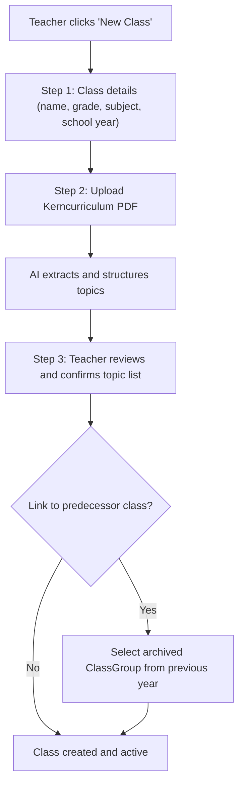
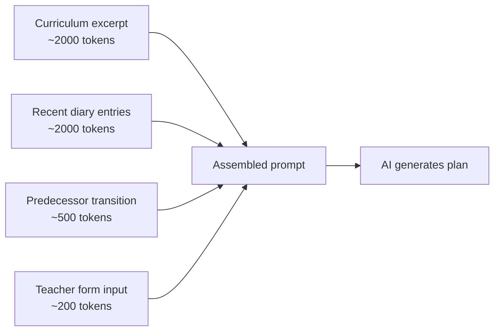
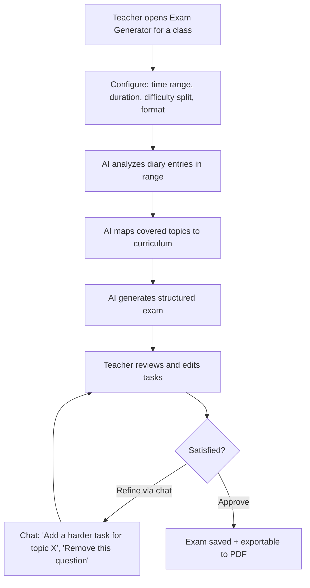
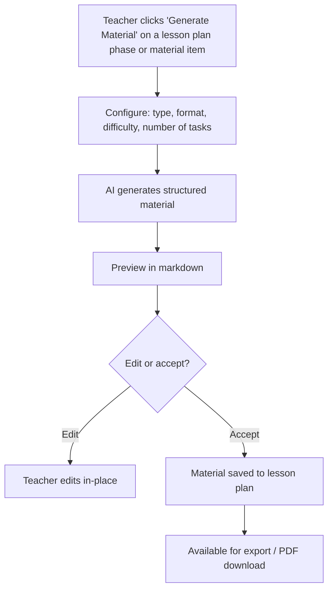
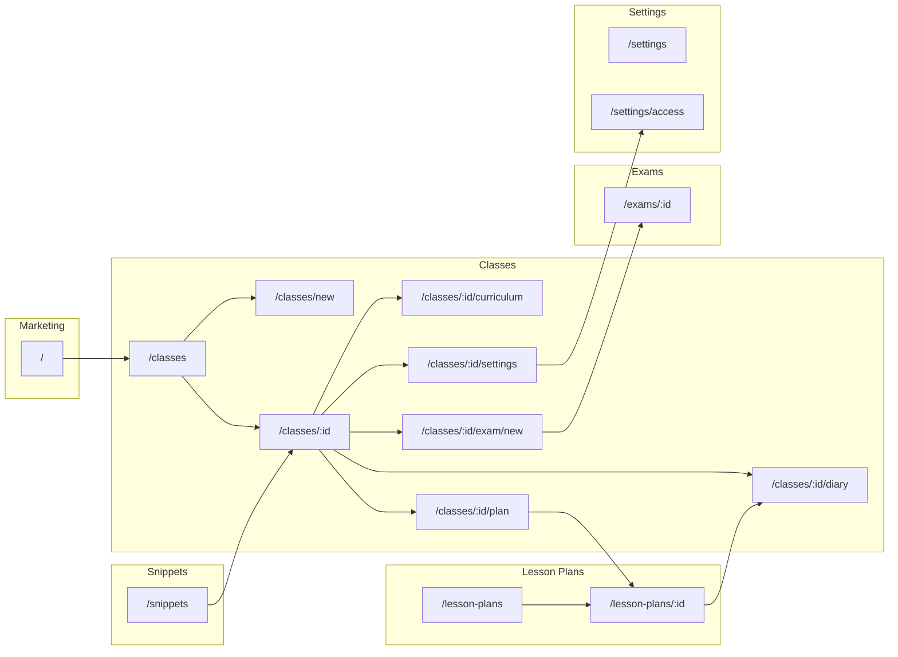

# Chalkdust — Product Vision

> The AI co-pilot every teacher deserves. Not a chatbot, not a document generator — a teaching partner that knows your classes, remembers what you did, and helps you do more of what works.

---

## Table of Contents

1. [The Idea](#1-the-idea)
2. [Core Principles](#2-core-principles)
3. [Feature 1 — Classes & Curriculum](#3-feature-1--classes--curriculum)
4. [Feature 2 — AI Lesson Planning](#4-feature-2--ai-lesson-planning)
5. [Feature 3 — Lesson Snippets](#5-feature-3--lesson-snippets)
6. [Feature 4 — Exam Generator](#6-feature-4--exam-generator)
7. [Feature 5 — Material & Worksheet Generator](#7-feature-5--material--worksheet-generator)
8. [Feature 6 — Shared Access & Substitute Flow](#8-feature-6--shared-access--substitute-flow)
9. [Agentic Ideas](#9-agentic-ideas)
10. [Screen Map](#10-screen-map)
11. [Data Model Evolution](#11-data-model-evolution)
12. [Implementation Phases](#12-implementation-phases)

---

## 1. The Idea

Teaching is one of the most knowledge-intensive jobs in the world — and almost none of that knowledge gets captured anywhere. Every teacher carries years of accumulated practice in their head: which warm-up games land with which grade, which topics need more time, which class responds well to group work and which needs structure. When the school year ends, much of that disappears.

**Chalkdust** is a teaching co-pilot that captures and activates that knowledge. At its core, it is an AI-assisted lesson planning tool for German teachers. But the real goal is broader: to be the place where a teacher's professional knowledge lives, grows, and pays off day after day. You plan lessons with AI support, you build a diary of what actually happened, you save the building blocks that worked, and over time the system knows your classes well enough to meaningfully help you prepare for them.

The product is built around a simple loop: **plan → teach → reflect → reuse**. Every cycle through that loop makes the next one better — because the AI has more context, the library has more building blocks, and the teacher has a clearer picture of where each class stands.

---

## 2. Core Principles

### Teacher first, AI second
The AI proposes; the teacher decides. Every AI output is editable. The teacher's judgment always overrides the system. Chalkdust never auto-applies anything without explicit confirmation.

### Context is everything
A generic lesson plan is easy to generate. A plan that knows this class spent three weeks struggling with fractions, has two highly capable students who need challenge, and will be taught on a Monday morning after a holiday — that is genuinely useful. Every feature is designed to deepen the context the AI has access to.

### Everything is reusable
Good work should not disappear after one lesson. Plans can be referenced. Phases can become snippets. Snippets can be reused across classes. Exams can be regenerated from the same curriculum coverage map. Chalkdust is an accumulator, not a disposable generator.

### Progress, not perfection
A lesson plan that gets refined through chat is better than one that sat unfinished. A diary entry with two sentences is better than none. The system is designed to accept partial input gracefully and still produce something useful.

### The diary is the ground truth
Everything the AI knows about a class flows through the class diary. If something happened in a lesson, it belongs in the diary. The richer the diary, the better every subsequent AI output becomes.

---

## 3. Feature 1 — Classes & Curriculum

### What it is

The foundation of everything in Chalkdust. A **ClassGroup** is the unit of organization: one teacher, one subject, one grade section, one school year. A teacher teaching Mathematik to both 5a and 5b has two ClassGroups. Every other feature — lesson plans, diary entries, snippets favorites, exams — is scoped to a ClassGroup or a teacher.

### Setup flow



The **Kerncurriculum** is the government-mandated curriculum document for a specific subject and grade. Uploading it is a one-time setup step. The AI extracts individual topics with titles, descriptions, and competency areas, and stores them as structured rows. These topics then drive the planning interface (topic dropdown, curriculum progress tracking) and the AI's understanding of what the class should be learning.

### Class detail hub

The `/classes/:id` page is the central hub for everything about a class. It answers the teacher's core question when they open the app: *"Where did I leave off, and what do I need to do next?"*

- Curriculum progress bar — how many topics have been covered vs. remaining
- Quick stats — lessons taught, hours recorded, topics completed
- Lesson timeline — reverse-chronological list of diary entries with status badges
- Upcoming planned lessons — future-dated approved plans shown above the timeline
- Primary action — "Plan Next Lesson" button, always visible

### Multi-year continuity

Classes don't reset at the end of the school year — knowledge about them should carry over. The system supports a `predecessorId` link: when a teacher creates a new ClassGroup for the next school year, they can optionally link it to last year's class.

At end-of-year, the teacher runs a **Close School Year** flow. The AI analyzes the full diary and generates a transition summary draft — overall assessment, documented strengths, documented weaknesses. The teacher reviews and edits it. The class is then archived (read-only but always accessible).

When the new ClassGroup is created and linked to its predecessor, the transition summary flows into the AI context for lesson planning: *"This class struggled with fractions last year and never finished the geometry unit."* The AI uses this to shape the first lessons of the new year appropriately.

### Implementation status
- ClassGroup CRUD: **built**
- Curriculum upload + AI extraction: **built**
- Curriculum topic review UI: **built**
- Class detail hub: **built**
- Predecessor linking schema: **built** (field exists)
- End-of-year transition flow: **not yet built**
- Transition summary in AI context: **not yet built**

---

## 4. Feature 2 — AI Lesson Planning

### What it is

The core loop of Chalkdust. A teacher selects a class, picks a date and topic, and the AI generates a full structured lesson plan. The teacher refines it through a chat interface, then approves it. Approval creates a diary entry automatically.

### Planning interface

The `/classes/:id/plan` page is a split-panel hybrid interface:

- **Left panel**: Structured form — date, duration, topic selector (from curriculum or free text), optional learning goal, optional notes (e.g. "we have the computer lab today")
- **Right panel**: AI-generated plan displayed as a structured document, with a chat input below

The chat allows conversational refinement: "Make the group work phase shorter", "Add a warm-up game", "The differentiation section needs more detail for weaker students." Each message triggers targeted tool-use updates — the AI modifies only the specific part of the plan that needs changing, rather than regenerating the whole thing.

### What the AI generates

Every lesson plan conforms to a strict schema, validated via Zod:

```
topic               — lesson title
objectives[]        — observable learning goals, linked to curriculum topics
timeline[]          — lesson phases (Einstieg, Erarbeitung, Sicherung, Abschluss)
  phase             — phase name
  durationMinutes   — time allocation
  description       — what happens (markdown supported)
  method            — teaching method (Gruppenarbeit, Frontalunterricht, etc.)
differentiation
  weaker            — adaptations for students who need support
  stronger          — extensions for students who need challenge
materials[]         — concrete list of what's needed
homework            — optional suggestion
```

Timeline durations must sum to the requested lesson length. The system validates this and retries with an explicit correction prompt if they don't.

### Context assembly

The AI's context is assembled from four sources:



**Curriculum excerpt**: The 3-topic window around the selected topic (previous, selected, next). Gives the AI a sense of what came before and what comes after — essential for sequencing.

**Recent diary entries**: The last 10 taught entries, formatted intelligently. Vague entries ("Alles wie geplant", "Erledigt") are replaced by structured data from the linked lesson plan. Deviated entries always show both what was planned and what actually happened.

**Predecessor transition summary**: Only included if the class has a predecessor link. Carries strengths and weaknesses from the previous school year.

**Teacher form input**: Date, duration, topic, goals, and any free-text notes.

### Plan refinement via tool-use

Refinement uses the fast AI model with tool-use (not full regeneration). Available tools:

| Tool | Effect |
|---|---|
| `update_plan_field` | Changes `topic` or `homework` |
| `update_timeline_phase` | Modifies a phase by index |
| `add_timeline_phase` | Inserts a new phase at a given position |
| `remove_timeline_phase` | Removes a phase by index |
| `update_objective` | Modifies a learning objective |
| `add_objective` | Adds a new objective |
| `update_differentiation` | Updates weaker/stronger text |
| `update_material` | Modifies a material item |
| `add_material` | Adds a new material |

This means the teacher sees exactly what changed, token usage is minimal for refinements, and the rest of the plan stays exactly as approved.

### The diary feedback loop

Approving a lesson plan auto-creates a diary entry with `progressStatus: "planned"`. After the lesson, the teacher updates the entry: what actually happened, any notes, the real status (completed / partial / deviated). Uploaded materials (worksheets the teacher printed, external PDFs used) attach to the diary entry and become part of the AI context for future planning sessions.

This feedback loop is what makes Chalkdust more valuable over time. The AI is not working from a blank slate — it is working from a growing, teacher-annotated record of what this specific class has done.

### Implementation status
- Lesson planning UI (form + plan view + chat): **built**
- Structured output generation with Zod schema: **built**
- Tool-use refinement: **built**
- Context assembly (curriculum + diary + predecessor): **built**
- Diary auto-creation on plan approval: **built**
- File upload to diary entries: **built**
- AI observability traces: **built**
- End-of-year transition context injection: **not yet built**

---

## 5. Feature 3 — Lesson Snippets

### What it is

Every teacher has a collection of activities that just work. An energizing warm-up dice game. A reliable group discussion structure. A quick quiz format that the class enjoys. Today that collection exists only in the teacher's head. Snippets is where it gets captured.

A **Lesson Snippet** is a single lesson phase — a self-contained building block — that the teacher can save, tag, reuse, and share across classes. The library has two levels: a **global library** (all snippets the teacher has ever saved) and **class-level favorites** (a curated subset that works particularly well for a specific class).

### The save flow

The most common way to create a snippet is directly from a lesson plan. Every timeline phase in the plan detail view has a bookmark icon. Clicking it opens a dialog pre-filled with the phase data — the teacher adds a title, optional tags, and optional private notes, then saves. The snippet is added to the global library immediately.

From that point, the snippet exists independently of its source plan. If the source plan is deleted, the snippet is preserved.

### The library

The `/snippets` page is the global snippet library. Features:

- Grid view of all snippets, grouped or filterable by phase type
- Tag filter — click any tag to narrow the list
- Per-class view — navigate from a class context to see only snippets favorited for that class
- Quick-create form — create a snippet from scratch (not from a plan)
- Preview modal — full description, method, duration, tags, and private notes

### Class favorites

Snippets belong to the teacher globally, but they can be marked as a favorite for a specific class. This is a lightweight pointer — not a copy. The snippet appears in the class-specific view but still lives in the global library. The same snippet can be a favorite for multiple classes simultaneously.

### Plug and play

When planning a lesson, a "From your snippets" panel appears alongside the generation form. The teacher can browse snippets filtered by phase (e.g. "show me Einstieg snippets I've saved") or by class favorites, and drop one into the timeline. The AI treats it as a fixed block and generates the rest of the lesson plan around it.

### AI-suggested snippets

When the AI generates a plan, it can optionally surface a match: "Your Einstieg looks similar to a snippet you saved — 'Würfelspiel Einstieg'. Want to use that instead?" This closes the loop between AI generation and the personal library, and over time trains the teacher's intuition for which of their snippets to reach for.

### Data model

```
LessonSnippet
  id, teacherId, title, phase, durationMinutes
  description (markdown), method, tags (jsonb string[])
  notes, sourceLessonPlanId (nullable FK, SET NULL on delete)
  createdAt, updatedAt

SnippetClassFavorite
  snippetId + classGroupId (composite PK)
  createdAt
```

### Implementation status
- Database tables (`lesson_snippets`, `snippet_class_favorites`): **built**
- Server actions (`createSnippet`, `getSnippets`, `getSnippet`): **built**
- API routes (GET/POST `/api/snippets`): **built**
- Save-from-plan dialog (`SaveSnippetDialog`): **built**
- Snippet library UI (`/snippets`): **built** (Phase 4 complete)
- Class favorites endpoints and UI: **not yet built**
- Plug-and-play in lesson planner: **not yet built**
- AI-suggested snippets: **not yet built**

---

## 6. Feature 4 — Exam Generator

### What it is

Writing a good exam takes hours. You need to select which topics to test, choose appropriate difficulty levels, write clear task descriptions, decide on point distributions, and prepare a solution sheet. Chalkdust can do the heavy lifting — because it already knows exactly what this class has covered.

The **Exam Generator** takes the class diary and curriculum coverage as input and produces a full, ready-to-use exam. The teacher controls the scope (which weeks or topics to include), the duration, and the difficulty balance. The AI does the rest.

### The generation flow



### What the AI generates

A structured exam conforming to a defined schema:

```
title           — e.g. "Klassenarbeit Nr. 2 — 5a Mathematik"
classGroupId    — link to the class
coveredTopics[] — which curriculum topics are being tested
duration        — total time in minutes
totalPoints     — sum of all task points
tasks[]
  title         — brief task name
  description   — full task text (markdown supported, can include LaTeX)
  points        — point value
  difficulty    — "basic" | "standard" | "extended"
  topicRef      — link to the curriculum topic being tested
  solution      — solution description (not shown to students; used for teacher's marking guide)
notes           — general notes for the teacher (e.g. "Task 3 is suitable as a bonus task")
```

### Context for generation

The AI uses:

1. **Diary entries in the selected time range** — what was actually taught, not just what was planned. Deviated and partial entries are handled the same way as in lesson planning.
2. **Curriculum topic coverage** — which topics are marked as covered or in-progress in the curriculum view.
3. **Teacher configuration** — duration, difficulty split (e.g. "40% basic, 50% standard, 10% extended"), any specific topics to include or exclude.
4. **Previous exams for this class** (if any) — to avoid repeating the same task formats or testing the same material twice.

### Refinement and export

Like lesson plans, exams are refined via chat using tool-use. The teacher can ask for individual tasks to be rewritten, replaced, or reweighted. Once satisfied, the exam can be exported to a print-ready PDF in two versions: student version (no solutions) and teacher version (with solutions and marking notes).

### Data model (new)

```
Exam
  id, classGroupId, teacherId
  title, duration, totalPoints
  status ("draft" | "approved")
  tasks (jsonb — array of task objects)
  coveredTopics (jsonb — array of curriculumTopicIds)
  timeRangeStart, timeRangeEnd
  notes
  createdAt, updatedAt
```

### Implementation status
- **Not yet built.** This is a planned future feature.

---

## 7. Feature 5 — Material & Worksheet Generator

### What it is

A lesson plan often says "students receive a worksheet on this topic" — but doesn't say what's on it. The teacher still has to create that worksheet from scratch. The **Material Generator** bridges this gap: from within a lesson plan or diary entry, the teacher can request a generated worksheet, handout, or exercise set. The AI uses the lesson's topic, objectives, and differentiation notes as context.

### The generation flow



### Material types

| Type | Description |
|---|---|
| **Worksheet** | Exercise set for students to work through independently — tasks, blank spaces for answers |
| **Handout** | Informational sheet — summaries, vocabulary lists, reference material |
| **Discussion prompt** | A structured set of questions for a group discussion or Unterrichtsgespräch |
| **Quiz** | Short formative assessment — multiple choice or short answer |
| **Differentiation sheet** | Two-tier version of a worksheet — simplified version and extended version side by side |

### AI context

The generator uses:

1. **Lesson topic and learning objectives** — from the lesson plan
2. **Phase context** — which phase this material is for (an Erarbeitung worksheet is different from an Abschluss quiz)
3. **Differentiation notes** — if the material is for a specific tier, the weaker/stronger guidance from the plan shapes the content
4. **Curriculum topic description** — gives the AI the exact competency area being targeted

### Output format

Materials are stored as **structured markdown** — richly formatted text that can be rendered in-app and converted to a clean PDF. The teacher can edit the content directly in the app before saving. Once approved, the material is attached to the lesson plan (or diary entry) as a `generated` material record.

For subjects requiring mathematical notation, the generator supports inline LaTeX (`$...$` blocks), which is rendered using a math typesetting library.

### Data model (new)

```
GeneratedMaterial
  id, teacherId, lessonPlanId (nullable), diaryEntryId (nullable)
  title, type ("worksheet" | "handout" | "quiz" | "discussion_prompt" | "differentiation_sheet")
  content (text — markdown + optional LaTeX)
  targetDifficulty ("basic" | "standard" | "extended" | "all")
  status ("draft" | "approved")
  createdAt, updatedAt
```

The existing `materials` table records a reference to the generated material; the content lives in `generated_materials`.

### Implementation status
- **Not yet built.** This is a planned future feature.

---

## 8. Feature 6 — Shared Access & Substitute Flow

### What it is

A teacher gets sick. Their substitute walks into class with no context — no idea what was covered last week, what materials the class uses, what the current topic is, or what was planned for today. This is a solvable problem.

**Shared access** lets the primary teacher grant another teacher (or a department head, or a school administrator) access to one or more of their classes. The accessing teacher sees the diary, the curriculum progress, the planned lessons, and the materials. They cannot edit plans or diary entries unless explicitly granted write access.

### Access levels

| Level | Can see | Can do |
|---|---|---|
| **Read-only** | All class content (diary, plans, curriculum, materials) | Nothing — view only |
| **Diary write** | All class content | Add diary entries and upload materials; cannot modify plans |
| **Full write** | All class content | Everything the primary teacher can do, except revoke other people's access |

### The substitute flow

When a substitute accesses a class they have been shared into:

1. They see the class diary and immediately understand what was covered recently
2. They see any upcoming planned lessons — including today's, if one exists
3. They can add a diary entry for the lesson they taught (so the primary teacher knows what happened)
4. They can upload any materials they used

This gives the primary teacher a complete record when they return, and gives the substitute enough context to run a coherent lesson.

### Access management

The primary teacher manages access from the class settings page:

- "Share this class" → enter email address → choose access level → send invite
- The invited teacher receives a notification and accepts
- The primary teacher can revoke access at any time
- An access log shows who has accessed the class and when

Access can be scoped to a single class or all classes. Time-limited access (e.g. "for this week only") is a useful extension.

### Data model (new)

```
ClassAccessGrant
  id
  classGroupId (FK → class_groups)
  grantedByTeacherId (FK → teachers)
  grantedToTeacherId (FK → teachers)
  accessLevel ("read_only" | "diary_write" | "full_write")
  expiresAt (nullable — for time-limited access)
  status ("pending" | "active" | "revoked")
  createdAt, updatedAt

ClassAccessLog
  id, classAccessGrantId
  actorTeacherId
  action (e.g. "viewed_diary", "added_diary_entry", "viewed_plan")
  createdAt
```

### Implementation status
- **Not yet built.** This is a planned future feature. Requires authentication to be implemented first.

---

## 9. Agentic Ideas

These are forward-looking ideas for how Chalkdust could deepen its role as an active teaching co-pilot — not just a tool that responds to requests, but one that proactively helps.

### Proactive lesson gap detection

The AI periodically scans the curriculum topic list and the diary. When it detects topics that were planned but never marked as completed, or topics that are overdue based on the school calendar, it surfaces a gentle alert: "You haven't covered 'Bruchrechnung — Erweiterung' yet and it was last scheduled 3 weeks ago. Want to plan a lesson for it?"

This turns the curriculum from a passive checklist into an active scheduling partner.

### Exam-to-diary loop

After an exam is graded, the teacher can log results back into Chalkdust: which tasks most students got wrong, the average score, and any notable observations. The AI adds this to the class diary as a structured entry. Future lesson planning context then includes: *"The class scored poorly on task 3 (Bruchrechnung — Ungleichnamige Brüche). This topic needs reinforcement."*

This closes the loop between assessment and planning — the two things that should inform each other most.

### Snippet suggestions during planning

When the AI is generating a lesson plan, it searches the teacher's snippet library for matches. Before presenting the plan, it checks: does any saved snippet match the phase type, topic, and class? If yes, it proposes using the snippet instead of generating from scratch: "I noticed you have a saved 'Gruppenarbeit Einstieg' snippet tagged 'fractions'. Want to use it for the opening phase?"

This gradually shifts the teacher's workflow from AI-generated-everything toward a blend of trusted personal building blocks and AI fill-in.

### End-of-year narrative report

At end-of-year, the AI can generate a full narrative report for the class — not just transition notes for the next teacher, but a comprehensive summary the teacher themselves can use: what was taught, how far through the curriculum they got, where the class excelled, where they struggled, and notable individual observations from the diary. The teacher reviews and edits it, and it becomes part of the class archive.

This is the teacher's memory of the year — structured, searchable, and ready to hand off.

### Cross-class pattern insights

A teacher often teaches the same subject to multiple classes at the same grade level (e.g. Mathematik to 5a and 5b). Chalkdust can surface patterns across those classes: "You covered Bruchrechnung 2 lessons faster with 5b than 5a. 5a also has more diary entries marked 'deviated' for this topic." These insights help the teacher adjust pacing and approach before the same issue repeats.

### Curriculum-aware homework coherence

When the AI suggests homework, it checks the recent diary: if the last three lessons all had homework, it suggests a lighter assignment. If the upcoming week has a school event, it avoids heavy homework for the days before. Small context-aware adjustments that a good teacher makes naturally — but that take time to remember.

### AI-generated lesson plan templates

Over time, the teacher accumulates approved lesson plans. The AI can analyze these to build personalized lesson plan templates: "You tend to structure your Mathematik Einführungsstunden with a 5-minute Einstieg, 25-minute Erarbeitung, and a 15-minute Sicherung. Want to use this as your default structure?" The AI learns the teacher's style and applies it by default.

### Smart diary prompts

After a lesson date passes, Chalkdust sends the teacher a prompt to update the diary. But instead of a generic "How did it go?", the prompt is specific: "You planned to do group work on Bruchrechnung today. Did the groups finish the activity? Anything to note about the differentiation?" AI-generated questions based on what was planned make it faster and more likely that the teacher fills in useful detail.

---

## 10. Screen Map



### Sidebar navigation

| Item | Route | Status |
|---|---|---|
| Meine Klassen | `/classes` | Built |
| Dashboard | `/dashboard` | Built |
| Unterrichtspläne | `/lesson-plans` | Built |
| Bausteine | `/snippets` | Built |
| Klausuren | `/exams` | Planned |
| Kalender | `/calendar` | Placeholder |
| KI-Assistent | `/ai-assistant` | Placeholder |
| Einstellungen | `/settings` | Planned |

---

## 11. Data Model Evolution

The current schema is solid for the core loop. New features require the following additions.

### Current tables (already built)
- `teachers`
- `class_groups`
- `curricula`
- `curriculum_topics`
- `lesson_plans`
- `diary_entries`
- `materials`
- `lesson_snippets`
- `snippet_class_favorites`
- `ai_traces`

### New tables needed

**`exams`** — Exam Generator (Feature 4)
```sql
CREATE TABLE exams (
  id           UUID PRIMARY KEY DEFAULT gen_random_uuid(),
  class_group_id UUID NOT NULL REFERENCES class_groups(id),
  teacher_id   UUID NOT NULL REFERENCES teachers(id),
  title        VARCHAR(500) NOT NULL,
  duration     INTEGER NOT NULL,        -- minutes
  total_points INTEGER NOT NULL,
  status       VARCHAR(20) NOT NULL DEFAULT 'draft',  -- draft | approved
  tasks        JSONB NOT NULL DEFAULT '[]',
  covered_topics JSONB NOT NULL DEFAULT '[]',         -- array of curriculumTopicIds
  time_range_start DATE,
  time_range_end   DATE,
  notes        TEXT,
  created_at   TIMESTAMP NOT NULL DEFAULT NOW(),
  updated_at   TIMESTAMP NOT NULL DEFAULT NOW()
);
```

**`generated_materials`** — Material Generator (Feature 5)
```sql
CREATE TABLE generated_materials (
  id             UUID PRIMARY KEY DEFAULT gen_random_uuid(),
  teacher_id     UUID NOT NULL REFERENCES teachers(id),
  lesson_plan_id UUID REFERENCES lesson_plans(id) ON DELETE SET NULL,
  diary_entry_id UUID REFERENCES diary_entries(id) ON DELETE SET NULL,
  title          VARCHAR(500) NOT NULL,
  type           VARCHAR(50) NOT NULL,   -- worksheet | handout | quiz | discussion_prompt | differentiation_sheet
  content        TEXT NOT NULL,          -- markdown + optional LaTeX
  target_difficulty VARCHAR(20),         -- basic | standard | extended | all
  status         VARCHAR(20) NOT NULL DEFAULT 'draft',
  created_at     TIMESTAMP NOT NULL DEFAULT NOW(),
  updated_at     TIMESTAMP NOT NULL DEFAULT NOW()
);
```

**`class_access_grants`** — Shared Access (Feature 6)
```sql
CREATE TABLE class_access_grants (
  id                     UUID PRIMARY KEY DEFAULT gen_random_uuid(),
  class_group_id         UUID NOT NULL REFERENCES class_groups(id) ON DELETE CASCADE,
  granted_by_teacher_id  UUID NOT NULL REFERENCES teachers(id),
  granted_to_teacher_id  UUID NOT NULL REFERENCES teachers(id),
  access_level           VARCHAR(20) NOT NULL,  -- read_only | diary_write | full_write
  expires_at             TIMESTAMP,
  status                 VARCHAR(20) NOT NULL DEFAULT 'pending',  -- pending | active | revoked
  created_at             TIMESTAMP NOT NULL DEFAULT NOW(),
  updated_at             TIMESTAMP NOT NULL DEFAULT NOW()
);

CREATE TABLE class_access_log (
  id                   UUID PRIMARY KEY DEFAULT gen_random_uuid(),
  class_access_grant_id UUID NOT NULL REFERENCES class_access_grants(id),
  actor_teacher_id     UUID NOT NULL REFERENCES teachers(id),
  action               VARCHAR(100) NOT NULL,
  created_at           TIMESTAMP NOT NULL DEFAULT NOW()
);
```

### Schema modifications needed on existing tables

- `materials`: add `generated_material_id` (nullable FK → `generated_materials`) so the existing materials table can reference a generated material record
- `lesson_snippets`: no changes needed — schema is already complete
- `class_groups`: no changes needed — `predecessor_id` and transition fields already exist

---

## 12. Implementation Phases

### Phase 0 — Foundation (current state)
- Classes, curriculum, lesson planning, diary, snippets (Phase 1) all built
- Hardcoded teacher, no auth
- Local file storage

### Phase 1 — Complete the snippet loop
Finish what's started in snippets:
- Class-specific favorites UI and endpoints
- Plug-and-play snippets panel in the lesson planner
- AI-suggested snippet matching during plan generation

### Phase 2 — Authentication
Required before shared access and production deployment:
- User accounts (Clerk or NextAuth)
- Replace hardcoded teacher ID with session-based identity
- Email-based invitations for shared access grants

### Phase 3 — Exam Generator
- `exams` table and Drizzle schema
- Exam generation AI agent (context: diary + curriculum coverage + teacher config)
- Exam review and refinement UI (chat-based, same pattern as lesson plans)
- PDF export (student version + teacher version with solutions)

### Phase 4 — Material & Worksheet Generator
- `generated_materials` table
- Material generation UI within lesson plan detail page
- Support for worksheet, handout, quiz, and differentiation sheet types
- PDF export with clean formatting and optional LaTeX rendering

### Phase 5 — Shared Access & Substitute Flow
- `class_access_grants` and `class_access_log` tables
- Invite flow and email notifications
- Access-scoped views (substitute sees what they need, nothing more)
- Access management UI in class settings

### Phase 6 — End-of-Year Transition (complete)
- LLM-generated transition summary draft
- Teacher review and edit UI
- Transition context injection into lesson planning for linked classes
- Multi-year class history chain view

### Phase 7 — Agentic Features (progressive rollout)
- Proactive lesson gap detection (passive scan, dashboard alert)
- Exam-to-diary loop (results logging, feedback into context)
- Snippet suggestions during plan generation
- End-of-year narrative report generation
- Cross-class pattern insights

---

*This document is the living north star for Chalkdust. Feature specs and architecture details for individual features live in [`docs/features/`](features/) and [`docs/architecture/`](architecture/). When something gets built, the status field in each feature section should be updated.*
