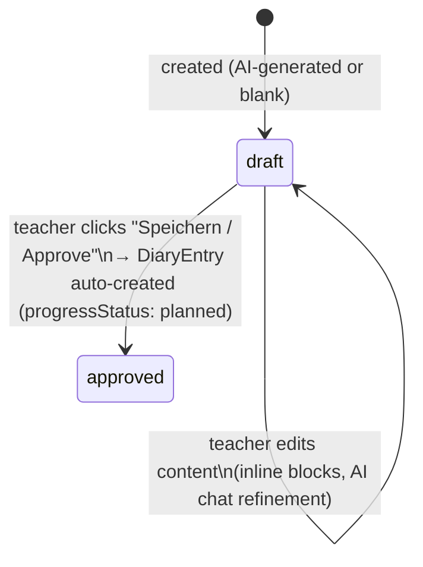
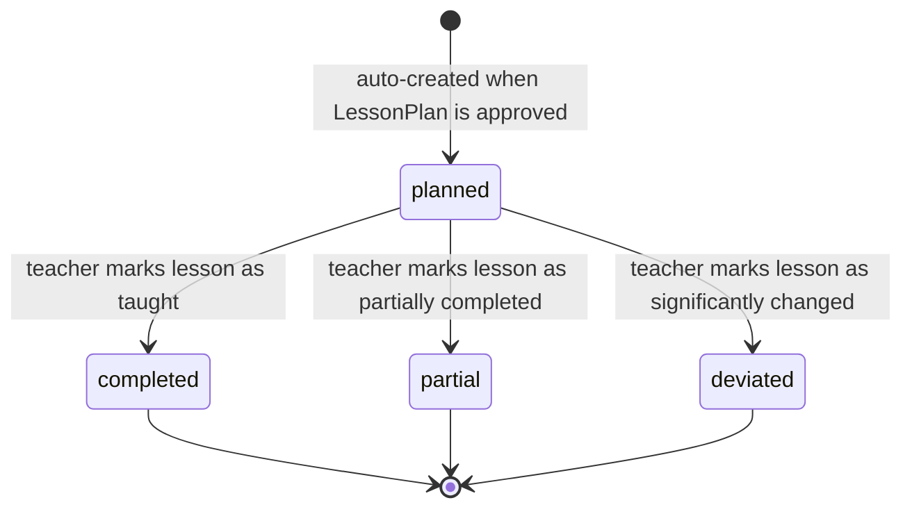
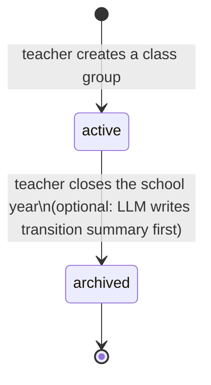
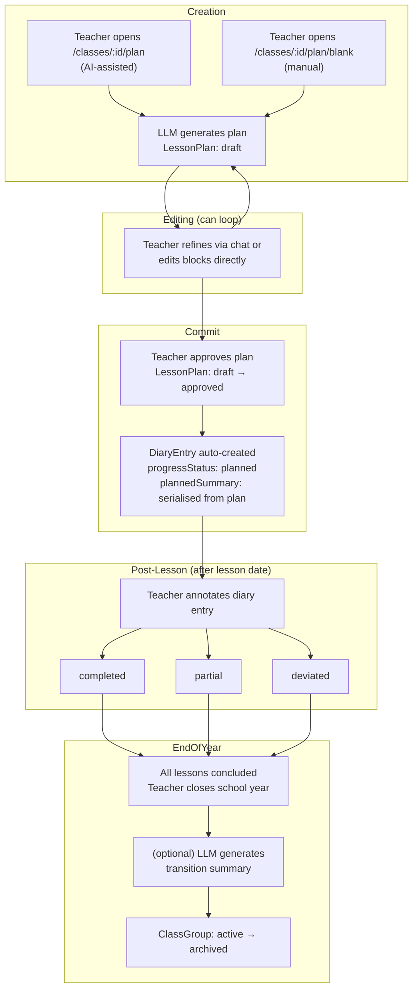

# Lesson Plan Lifecycle

> **Status:** partial
> **Created:** 2026-03-12
> **Updated:** 2026-03-12

## Overview

This document maps the current lifecycle of a lesson plan — from creation to post-lesson reflection — across the three entities that carry state: `LessonPlan`, `DiaryEntry`, and `ClassGroup`. It is intentionally descriptive rather than prescriptive: the goal is to make the current mechanics visible so they can be critiqued and improved.

---

## State machines

### LessonPlan.status

**Values:** `draft` · `approved`

The `draft` state is the only active editing state. Both AI-assisted and manually created plans start here. A plan remains `draft` indefinitely until the teacher explicitly approves it. There is no status that represents "being taught" or "already taught" — that information is carried entirely by the linked `DiaryEntry`.

---

### DiaryEntry.progressStatus

**Values:** `planned` · `completed` · `partial` · `deviated`

A `DiaryEntry` is created automatically when a `LessonPlan` is approved. At this point the `plannedSummary` is serialised from the plan's topic and timeline. The teacher later updates the entry after the lesson, setting `actualSummary`, `teacherNotes`, and the final `progressStatus`.

---

### ClassGroup.status

**Values:** `active` · `archived`

Archived groups are read-only. They remain fully accessible for reference and for feeding predecessor context into a successor class group.

---

## Combined flow

The diagram below shows how the three state machines interact across the full lifecycle of a single lesson.

---

## Problems with the current lifecycle

### 1. `draft` / `approved` is a thin and misleading split

"Approved" does not mean the lesson was taught or even scheduled — it just means the teacher saved the plan and committed to using it. In practice, a plan stays `draft` while the teacher tinkers in AI chat, then flips to `approved` when they are done. The word "approved" has connotations of a formal sign-off that do not match the teacher's mental model ("I'm done editing this, move on").

### 2. No status for "taught"

The `LessonPlan` entity has no way to express that the associated lesson has been delivered. That information lives only in `DiaryEntry.progressStatus`. This means:

- A lesson plan and its diary entry are in separate state machines that must be cross-referenced to understand the true state of a lesson.
- Queries like "show me all lessons I have already taught" require a JOIN and filter on `DiaryEntry.progressStatus`, not on `LessonPlan.status`.

### 3. `draft` plans without a diary entry are invisible in the diary

A `draft` plan has no diary entry. If the teacher creates a plan, leaves it in `draft`, and the lesson date passes, the lesson simply does not appear in the diary. There is no warning, no orphan indicator.

### 4. The approval → diary-creation coupling is a side effect

Creating a `DiaryEntry` is a hidden side effect of calling `approveLessonPlan()`. This is opaque to the teacher — there is no moment where the diary entry creation is confirmed or visible before it happens.

### 5. No "cancelled" or "skipped" state

If the teacher decides not to teach a planned lesson (school closed, topic dropped), there is no way to mark it as cancelled. The plan stays `approved` and the diary entry stays `planned` forever, polluting the diary with ghost entries.

---

## Observations for redesign

These are open questions — not decisions. The purpose of this document is to surface the tensions, not resolve them.

- Should `LessonPlan` status track the editorial lifecycle (draft → ready) and `DiaryEntry` track the delivery lifecycle (upcoming → taught)? Or should one entity own both?
- Should approval be renamed to something that reflects teacher intent rather than a formal gate (e.g., "committed", "ready", "filed")?
- Should a `cancelled` / `skipped` terminal state exist on the diary entry?
- Should `draft` plans show up in the diary as "unconfirmed" entries to prevent silent gaps?
- Is `DiaryEntry` the right place to track post-lesson state, or should it be folded back into `LessonPlan` (with lesson plan owning the full lifecycle from creation to reflection)?
