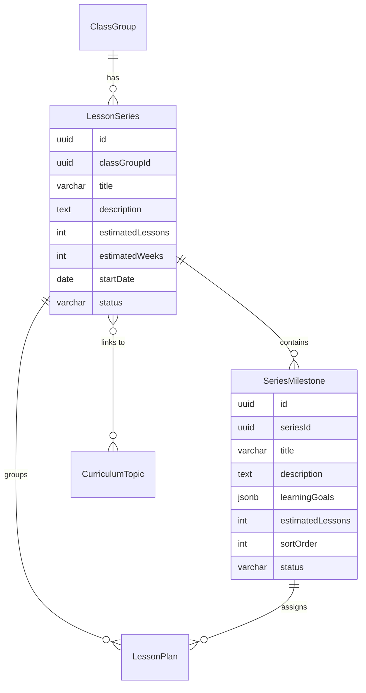

# Lesson Series (Reihenplanung / Unterrichtsreihe)

> **Status:** partial
> **Created:** 2026-03-12
> **Updated:** 2026-03-12

## 1. Feature Summary

Lesson Series introduces an optional middle layer between Lehrplan topics and individual lesson plans. A **Reihe** (Unterrichtsreihe) represents a multi-lesson arc — a coherent unit of instruction that builds progressively toward a goal over multiple lessons.

The core problem it solves: before this feature, Chalkdust generated lessons in isolation. The diary system provided backward-looking continuity ("what did we do last time?") but there was no forward-looking structure ("where is this topic heading over the next 8 weeks?"). Teachers mentally carried the "roter Faden" — the coherent thread connecting lessons — but the system had no representation of it.

### Design Principles

- **Optional, not mandatory.** Teachers can still plan one-off lessons without a Reihe. The existing "Stunde planen" flow is unchanged.
- **AI-drafted, teacher-owned.** The AI suggests milestone breakdowns; the teacher edits everything. All AI output is a draft.
- **Flexible binding.** A Reihe can link to 0, 1, or multiple Lehrplan topics. Multiple Reihen can cover the same topic. Short 2-lesson Reihen are fine; 20-lesson ones are fine too.
- **Living document.** Taught lessons are locked; future milestones stay editable.
- **Quality first.** No token caps on the Reihe context layer — the system provides full milestone details to the AI for maximum generation quality.

---

## 2. Domain Model

### New entities



### `lesson_series`

| Column | Type | Notes |
|---|---|---|
| `id` | uuid PK | |
| `class_group_id` | uuid FK → class_groups | cascade delete |
| `title` | varchar(255) | e.g. "Podiumsdiskussion" |
| `description` | text | Overall goal/vision |
| `estimated_lessons` | integer | Teacher's estimate of total lessons |
| `estimated_weeks` | integer, nullable | |
| `start_date` | date, nullable | |
| `status` | varchar(20) | `draft` / `active` / `completed` |
| `created_at`, `updated_at` | timestamp | |

### `series_milestones`

| Column | Type | Notes |
|---|---|---|
| `id` | uuid PK | |
| `series_id` | uuid FK → lesson_series | cascade delete |
| `title` | varchar(500) | |
| `description` | text | |
| `learning_goals` | jsonb | Array of `{ text: string }` |
| `estimated_lessons` | integer | Lessons needed for this milestone |
| `sort_order` | integer | |
| `status` | varchar(20) | `pending` / `in_progress` / `completed` |
| `created_at`, `updated_at` | timestamp | |

### `series_curriculum_topics` (join table)

| Column | Type | Notes |
|---|---|---|
| `series_id` | uuid FK → lesson_series | Composite PK |
| `curriculum_topic_id` | uuid FK → curriculum_topics | Composite PK |

### Changes to `lesson_plans`

Two nullable FK columns added:

- `series_id` → lesson_series (on delete: set null)
- `milestone_id` → series_milestones (on delete: set null)

A lesson plan can exist without a series (one-off) or belong to a series and optionally a specific milestone.

---

## 3. UX Flow

### Creating a Reihe

1. Teacher navigates to `/classes/:id/series` and clicks "Reihe planen"
2. Fills the form: title, description/end goal, estimated lessons, estimated weeks, optional Lehrplan topic links, additional notes
3. Clicks "Meilensteine generieren" → AI generates an ordered list of milestones
4. Teacher reviews, edits, adds, removes, reorders milestones
5. Saves → Reihe created as `active` (with milestones) or `draft` (without)

The teacher can skip AI generation and create milestones manually.

### Reihe Detail View (milestone timeline)

The detail page at `/classes/:id/series/:seriesId` shows a vertical milestone timeline. Each milestone is a card connected by a vertical line — the "roter Faden."

Visual states:
- **Completed**: Solid primary circle with check icon, muted card background
- **In progress**: Pulsing ring node, elevated card with ring and shadow
- **Pending**: Hollow muted circle, normal card

Each milestone card shows: title, description, learning goal chips, linked lessons with status dots, and action buttons.

### Planning a lesson within a Reihe

From the "Nächste Stunde planen" button on a milestone card:

1. Opens `/classes/:id/plan?seriesId=X&milestoneId=Y`
2. Form pre-populates: topic from milestone title, learning goals from milestone
3. A banner shows the series/milestone context
4. `assembleContext` includes the full Reihe context layer
5. Normal flow: generate → refine via chat → approve → diary entry

### One-off lessons (unchanged)

Teachers who don't use Reihen see no changes. The existing "Stunde planen" and "Manuell erstellen" flows work as before.

---

## 4. AI Integration

### Reihe Milestone Generation

A new AI mode: `series_generation`.

- **Prompt**: `src/lib/ai/prompts/series-generation.ts` — German pedagogical guidelines for progressive unit planning, scaffolding, building complexity
- **Schema**: `seriesGenerationSchema` in `src/lib/ai/schemas.ts` — returns `{ milestones: Array<{ title, description, learningGoals, estimatedLessons }> }`
- **Endpoint**: `POST /api/series/generate`
- **Model**: Uses the `high` tier model (creative + structured)

### Context Assembly — Reihe Layer

`assembleContext` in `src/lib/ai/context.ts` accepts two new optional parameters: `seriesId` and `milestoneId`.

When provided, a new context layer is inserted **between the Lehrplan excerpt and diary entries**:

```
## Unterrichtsreihe: {title}

Ziel: {description}
Geplante Stunden: {estimatedLessons} | Bisher durchgeführt: {completedCount}

### Meilensteine:
1. [Abgeschlossen] {title} — {description}
   Ziele: {learningGoals}
   Bisherige Stunden: {diary summaries}
2. [Aktuell] {title} — {description}
   ...

### Aktuelle Stunde:
Meilenstein: {currentTitle}
Position: Stunde {n} von {est} in diesem Meilenstein
```

**Critical**: This is additive. All existing context layers — Lehrplan, diary entries (taught + planned), predecessor transition — remain fully intact. The diary feedback loop is preserved.

**No token caps.** All milestones get full detail (title, description, learning goals, lesson summaries). Optimization deferred until proven necessary.

Full context stack for a lesson inside a Reihe:

1. Static layers (role, pedagogy, format, tools)
2. Curriculum excerpt
3. **Reihenplanung** (new)
4. Diary entries (taught + planned)
5. Predecessor transition summary
6. Teacher input (+ milestone pre-population)

---

## 5. API and Server Action Contracts

### API Routes

| Method | Endpoint | Purpose |
|---|---|---|
| `GET` | `/api/classes/:id/series` | List all series for a class |
| `POST` | `/api/classes/:id/series` | Create a series (with milestones) |
| `GET` | `/api/series/:id` | Get series with milestones, linked plans, diary entries |
| `PATCH` | `/api/series/:id` | Update series metadata |
| `DELETE` | `/api/series/:id` | Delete series (unlinks plans) |
| `POST` | `/api/series/:id/milestones` | Add a milestone |
| `PATCH` | `/api/series/:id/milestones/:milestoneId` | Update a milestone |
| `DELETE` | `/api/series/:id/milestones/:milestoneId` | Delete a milestone (unlinks plans) |
| `PATCH` | `/api/series/:id/milestones/reorder` | Reorder milestones |
| `POST` | `/api/series/generate` | AI generates milestones from teacher input |

### Modified Routes

- `POST /api/lesson-plans/generate` — accepts optional `seriesId` and `milestoneId`, passes to `assembleContext`

### Server Actions (`src/lib/actions/series.ts`)

- `createSeries(classGroupId, data)` — creates series with milestones and Lehrplan topic links
- `getSeries(seriesId)` — single series record
- `getSeriesWithDetails(seriesId)` — series + milestones + linked plans + diary entries
- `getSeriesForClass(classGroupId)` — all series for a class
- `updateSeries(seriesId, updates)` — update metadata
- `deleteSeries(seriesId)` — unlinks plans, deletes series
- `addMilestone(seriesId, data, insertAfterOrder?)` — add with order management
- `updateMilestone(milestoneId, updates)` — update fields
- `deleteMilestone(milestoneId)` — unlinks plans, deletes
- `reorderMilestones(seriesId, orderedIds)` — reorder by ID array

### Modified Actions

- `saveLessonPlan` — accepts optional `seriesId` and `milestoneId`
- `createBlankLessonPlan` — accepts optional `seriesId` and `milestoneId`

### Milestone Auto-Status

When a diary entry's `progressStatus` is updated, `syncMilestoneStatus` (in `src/lib/actions/diary.ts`) checks all plans linked to the same milestone. If all are taught → milestone `completed`. If any taught → `in_progress`. Otherwise → `pending`.

---

## 6. Component Architecture

### Pages

| Route | Component | Type |
|---|---|---|
| `/classes/:id/series` | Series list page | Server |
| `/classes/:id/series/new` | Server wrapper + `NewSeriesForm` | Server + Client |
| `/classes/:id/series/:seriesId` | Server wrapper + `SeriesDetailClient` | Server + Client |

### Key Components

- **`NewSeriesForm`** (`series/new/new-series-form.tsx`) — Form for series metadata + milestone generation and editing. Handles AI generation, manual milestone add/edit/delete.
- **`SeriesDetailClient`** (`series/[seriesId]/series-detail-client.tsx`) — The milestone timeline view. Vertical timeline with status-dependent nodes and cards. Inline milestone editing. Links to plan creation flow.

### Integration Points

- **Class detail page** (`/classes/:id`): "Reihenplanung" quick-link card + "Unterrichtsreihen" section showing active series
- **Plan creation page** (`/classes/:id/plan`): Reads `seriesId` and `milestoneId` from URL search params. Pre-populates form, shows series context banner, passes IDs to generation API.

---

## 7. Design Decisions

1. **Series/milestone IDs on lesson_plans are nullable with `set null` on delete.** Deleting a series does not cascade-delete its lesson plans — they become standalone plans. This prevents data loss.

2. **Milestone status is auto-computed but stored.** Computed from linked lesson diary statuses, but persisted as a column to enable efficient queries without joins.

3. **No token budget caps on Reihe context.** Quality of generation directly impacts the teacher's classroom. Token optimization is deferred.

4. **Flexible Lehrplan topic binding.** A many-to-many join table (`series_curriculum_topics`) rather than a single FK, because a Reihe can span multiple topics and multiple Reihen can share a topic.

5. **`assembleContext` signature is backward-compatible.** The new `seriesId` and `milestoneId` parameters are optional — all existing callers work without changes.

---

## 8. Eval

`evals/series-generation.eval.ts` tests milestone generation quality:

- **Milestone count in range** — appropriate number for the topic duration
- **Estimated lessons sum matches** — total ≈ requested (±20% tolerance)
- **All milestones have learning goals** — no empty milestones
- **Learning goals are measurable** — no vague verbs
- **Progressive complexity** — first milestones use intro terms, last use application/transfer terms
- **All milestones have descriptions** — non-trivial (>20 chars)

### Roadmap

- Drag-to-reorder milestones on the detail page (using existing `@dnd-kit` patterns)
- Reihe completion summary (AI-generated) when all milestones are done
- Retroactive linking: assign existing standalone lesson plans to a Reihe
- Curriculum progress view enhanced with Reihe coverage visualization
