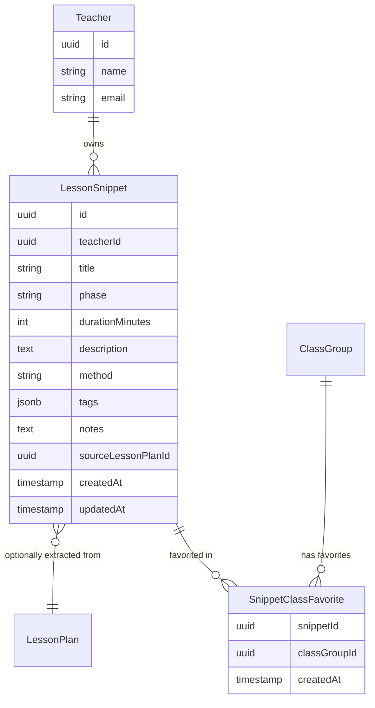

# Lesson Snippets — Feature Architecture Document

> **Status:** partial
> **Created:** 2026-02-28
> **Updated:** 2026-03-05 (Work Stream 1 — class-specific favorites — complete)

## 1. North Star Vision

A teacher accumulates knowledge over years of practice. Some activities work brilliantly with one class, some games land perfectly for a particular age group, some warm-up routines are just reliable. Today, that knowledge lives only in the teacher's head. Chalkdust should be the place where it gets captured, organized, and reused.

**Lesson Snippets** are the building blocks of a lesson — individual phases like an *Einstieg*, a *Sicherung*, a game, a discussion prompt, or a differentiation approach. The North Star is a **plug-and-play library** of these blocks that a teacher can:

1. **Save** — from scratch, or by extracting a phase directly out of an AI-generated lesson plan they liked.
2. **Star / favorite** — mark snippets they want to reach quickly.
3. **Tag and search** — organize snippets however makes sense to them (by topic, method, grade-level suitability, etc.).
4. **Assign to a class** — mark a snippet as "this works for 7b" while keeping it in the global collection. Class-specific favorites are a curated subset, not a separate copy.
5. **Plug back in** — when planning a new lesson, browse the snippet library and drop a saved block into the timeline instead of asking the AI to generate something from scratch.

The lesson planner and the snippet library will be two sides of the same coin: AI goes from zero to a full plan, snippets let you build from proven building blocks.

---

## 2. Domain Model



### Field Reference

| Field | Purpose |
|---|---|
| `title` | Teacher-facing name for the snippet, e.g. "Würfelspiel Einstieg" |
| `phase` | Which lesson phase this belongs to: `Einstieg`, `Erarbeitung`, `Sicherung`, `Abschluss`, or any custom label |
| `durationMinutes` | How long this block typically takes (nullable — some blocks are flexible) |
| `description` | The full content of the block: what happens, instructions, prompts (markdown supported) |
| `method` | Teaching method: `Unterrichtsgespräch`, `Gruppenarbeit`, `Einzelarbeit`, `Partnerarbeit`, etc. |
| `tags` | Free-form string array for personal organization, e.g. `["game", "5th-grade", "fractions"]` |
| `notes` | Private teacher notes, e.g. "Works well for energetic classes but not right before an exam" |
| `sourceLessonPlanId` | Nullable FK back to the `LessonPlan` this was extracted from. Enables traceability. |

---

## 3. Current Implementation

### What is built

- **Database tables**: `lesson_snippets` and `snippet_class_favorites` in [`src/lib/db/schema.ts`](../src/lib/db/schema.ts)
- **Server actions** in [`src/lib/actions/snippets.ts`](../src/lib/actions/snippets.ts):
  - `createSnippet(teacherId, data)` — saves a new snippet
  - `getSnippets(teacherId, filters?)` — lists all snippets; accepts `{ tag?, classGroupId? }` — when `classGroupId` is set, SQL `INNER JOIN` on `snippet_class_favorites` returns only favorited snippets for that class
  - `getSnippet(id)` — fetches a single snippet by ID
  - `addClassFavorite(snippetId, classGroupId)` — `INSERT … ON CONFLICT DO NOTHING` (idempotent)
  - `removeClassFavorite(snippetId, classGroupId)` — removes a single class pointer
  - `getClassFavorites(classGroupId)` — returns all snippets favorited for a given class, ordered by `created_at DESC`
  - `getSnippetFavoriteClasses(snippetId)` — returns `classGroupId[]` for which classes have a given snippet favorited (used by the lazy-load popover)
- **API routes**:
  - `POST /api/snippets` — create a snippet
  - `GET /api/snippets` — list snippets (accepts `?tag=` and `?classGroupId=` query params)
  - `GET /api/snippets/:id/favorites` — returns `{ classGroupIds: string[] }` for that snippet
  - `POST /api/snippets/:id/favorites` — body `{ classGroupId }`, adds class favorite → 201
  - `DELETE /api/snippets/:id/favorites/:classGroupId` — removes class favorite → 204
- **Snippet library UI** at `/snippets`:
  - Grid view with tag filter pills
  - When navigated from a class context (`?classGroupId=`), shows a "Klassen-Favoriten / Alle Bausteine" toggle (defaults to favorites)
  - Star icon on every card; **in class context** — direct optimistic toggle (fills amber when favorited, outline otherwise, reverts on error); **in global view** — opens a lazy-loading popover showing all active classes with checkboxes pre-populated from `GET /api/snippets/:id/favorites`
- **Class detail page** (`/classes/:id`):
  - "Bausteine" section showing up to 6 class-favorited snippets (phase badge + title + duration + method)
  - "Alle anzeigen →" link to `/snippets?classGroupId=:id`
  - Empty state with direct link to the library

### UX flows

**Class context** (`/snippets?classGroupId=<id>`, reached from the class detail page):

```
Teacher clicks ★ on card
  → Optimistic: star fills immediately (localFavorites Set updated)
  → POST /api/snippets/:id/favorites { classGroupId }
  → On success: confirmed
  → On error: revert + toast
```

**Global view** (`/snippets`, no class context):

```
Teacher clicks ★ on card
  → Popover opens with spinner
  → GET /api/snippets/:id/favorites → { classGroupIds }
  → Spinner replaced by class list with pre-checked checkboxes
  → Each checkbox toggle fires POST or DELETE immediately
  → Star fills amber if any class is checked; outline if none
```

### Creating a snippet via API

```http
POST /api/snippets
Content-Type: application/json

{
  "title": "Würfelspiel Einstieg",
  "phase": "Einstieg",
  "durationMinutes": 10,
  "description": "Students roll dice in pairs. Each number maps to a question about last lesson's topic. Whoever answers correctly keeps the die.",
  "method": "Partnerarbeit",
  "tags": ["game", "review", "einstieg"],
  "notes": "Works best with classes that need high energy at the start.",
  "sourceLessonPlanId": "optional-uuid-if-extracted-from-a-plan"
}
```

Response `201 Created`:
```json
{
  "id": "...",
  "teacherId": "...",
  "title": "Würfelspiel Einstieg",
  "phase": "Einstieg",
  "durationMinutes": 10,
  "description": "...",
  "method": "Partnerarbeit",
  "tags": ["game", "review", "einstieg"],
  "notes": "Works best with classes that need high energy at the start.",
  "sourceLessonPlanId": null,
  "createdAt": "...",
  "updatedAt": "..."
}
```

---

## 4. Roadmap

### Next — Extract from lesson plan (Work Stream prerequisite)

Add an endpoint `POST /api/snippets/extract` (or a server action) that accepts a `lessonPlanId` and a `timelinePhaseIndex`, extracts that specific phase from the plan's `timeline` JSONB array, and saves it as a snippet. The `sourceLessonPlanId` is automatically set. This is the "star a phase you liked" UX flow.

### Next — Plug and play in the lesson planner (Work Stream 2)

A "From your snippets" collapsible panel in `/classes/:id/plan`:
- Phase filter tabs + "Class favorites only" toggle
- Pre-generation pinning: pinned snippets are injected into the LLM generation prompt as fixed constraints
- Post-generation insert: "Add to plan" opens a phase picker to replace or insert adjacent to existing phases
- Pinned phases visually labeled in the plan view

See [`planning/phase-0-1/phase-0-and-phase-1.md`](../planning/phase-0-1/phase-0-and-phase-1.md) Work Stream 2 for full spec.

### Next — AI-suggested snippet matching (Work Stream 3)

After plan generation, an async secondary LLM call checks whether any generated phase matches a saved snippet. If so, a suggestion strip appears inline in the plan view: "Your Einstieg looks similar to 'Würfelspiel'. Use it?" Clicking replaces the phase; clicking "Dismiss" removes the suggestion without affecting the plan.

See [`planning/phase-0-1/phase-0-and-phase-1.md`](../planning/phase-0-1/phase-0-and-phase-1.md) Work Stream 3 for full spec.

---

## 5. Design Decisions

- **Global ownership, not per-class**: Snippets belong to the teacher, not to a class. Class favorites are a lightweight pointer, not a copy. This avoids duplication and lets the same block be shared across classes.
- **JSONB for tags**: Tags are intentionally unstructured — teachers should be able to label things however makes sense to them without needing a separate tag management screen. A simple string array is sufficient.
- **`sourceLessonPlanId` is `SET NULL` on delete**: If the source lesson plan is deleted, the snippet is preserved. The snippet has standalone value independent of its origin.
- **Mirrors `TimelinePhase` schema**: The snippet fields (`phase`, `durationMinutes`, `description`, `method`) are a deliberate superset of the existing `TimelinePhase` type in [`src/lib/ai/schemas.ts`](../src/lib/ai/schemas.ts). This makes converting a saved snippet back into a timeline phase lossless.
