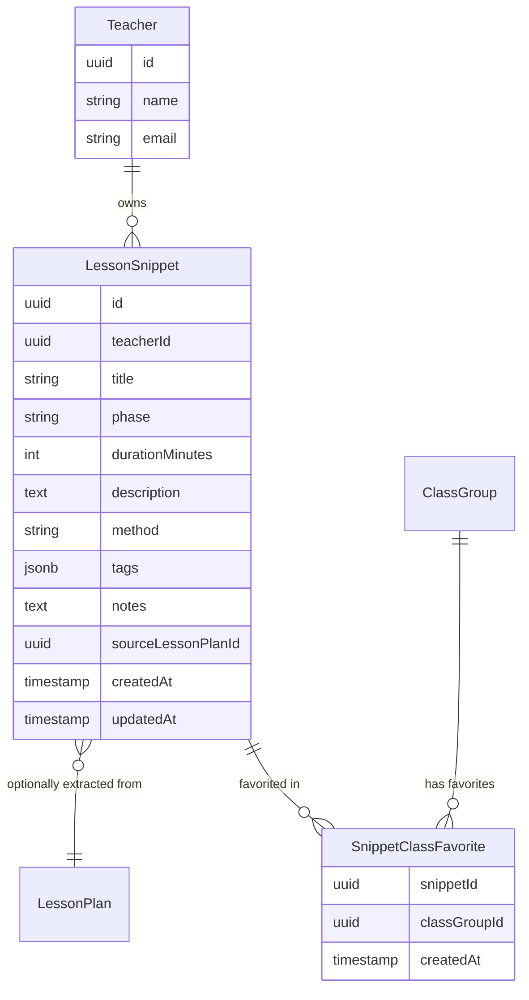

# Lesson Snippets — Feature Architecture Document

> **Status:** partial
> **Created:** 2026-02-28
> **Updated:** 2026-03-05

## 1. North Star Vision

A teacher accumulates knowledge over years of practice. Some activities work brilliantly with one class, some games land perfectly for a particular age group, some warm-up routines are just reliable. Today, that knowledge lives only in the teacher's head. Chalkdust should be the place where it gets captured, organized, and reused.

**Lesson Snippets** are the building blocks of a lesson — individual phases like an *Einstieg*, a *Sicherung*, a game, a discussion prompt, or a differentiation approach. The North Star is a **plug-and-play library** of these blocks that a teacher can:

1. **Save** — from scratch, or by extracting a phase directly out of an AI-generated lesson plan they liked.
2. **Star / favorite** — mark snippets they want to reach quickly.
3. **Tag and search** — organize snippets however makes sense to them (by topic, method, grade-level suitability, etc.).
4. **Assign to a class** — mark a snippet as "this works for 7b" while keeping it in the global collection. Class-specific favorites are a curated subset, not a separate copy.
5. **Plug back in** — when planning a new lesson, browse the snippet library and drop a saved block into the timeline instead of asking the AI to generate something from scratch.

The lesson planner and the snippet library will be two sides of the same coin: AI goes from zero to a full plan, snippets let you build from proven building blocks.

---

## 2. Domain Model



### Field Reference

| Field | Purpose |
|---|---|
| `title` | Teacher-facing name for the snippet, e.g. "Würfelspiel Einstieg" |
| `phase` | Which lesson phase this belongs to: `Einstieg`, `Erarbeitung`, `Sicherung`, `Abschluss`, or any custom label |
| `durationMinutes` | How long this block typically takes (nullable — some blocks are flexible) |
| `description` | The full content of the block: what happens, instructions, prompts (markdown supported) |
| `method` | Teaching method: `Unterrichtsgespräch`, `Gruppenarbeit`, `Einzelarbeit`, `Partnerarbeit`, etc. |
| `tags` | Free-form string array for personal organization, e.g. `["game", "5th-grade", "fractions"]` |
| `notes` | Private teacher notes, e.g. "Works well for energetic classes but not right before an exam" |
| `sourceLessonPlanId` | Nullable FK back to the `LessonPlan` this was extracted from. Enables traceability. |

---

## 3. Current Implementation (Phase 1)

### What is built

- **Database tables**: `lesson_snippets` and `snippet_class_favorites` in [`src/lib/db/schema.ts`](../src/lib/db/schema.ts)
- **Server actions** in [`src/lib/actions/snippets.ts`](../src/lib/actions/snippets.ts):
  - `createSnippet(teacherId, data)` — saves a new snippet
  - `getSnippets(teacherId, filters?)` — lists all snippets, with optional tag filter
  - `getSnippet(id)` — fetches a single snippet by ID
- **API routes** in [`src/app/api/snippets/route.ts`](../src/app/api/snippets/route.ts):
  - `POST /api/snippets` — create a snippet
  - `GET /api/snippets` — list snippets (accepts `?tag=` query param)

### Creating a snippet via API

```http
POST /api/snippets
Content-Type: application/json

{
  "title": "Würfelspiel Einstieg",
  "phase": "Einstieg",
  "durationMinutes": 10,
  "description": "Students roll dice in pairs. Each number maps to a question about last lesson's topic. Whoever answers correctly keeps the die.",
  "method": "Partnerarbeit",
  "tags": ["game", "review", "einstieg"],
  "notes": "Works best with classes that need high energy at the start.",
  "sourceLessonPlanId": "optional-uuid-if-extracted-from-a-plan"
}
```

Response `201 Created`:
```json
{
  "id": "...",
  "teacherId": "...",
  "title": "Würfelspiel Einstieg",
  "phase": "Einstieg",
  "durationMinutes": 10,
  "description": "...",
  "method": "Partnerarbeit",
  "tags": ["game", "review", "einstieg"],
  "notes": "Works best with classes that need high energy at the start.",
  "sourceLessonPlanId": null,
  "createdAt": "...",
  "updatedAt": "..."
}
```

---

## 4. Roadmap

### Phase 2 — Extract from lesson plan

Add an endpoint `POST /api/snippets/extract` (or a server action) that accepts a `lessonPlanId` and a `timelinePhaseIndex`, extracts that specific phase from the plan's `timeline` JSONB array, and saves it as a snippet. The `sourceLessonPlanId` is automatically set. This is the "star a phase you liked" UX flow.

### Phase 3 — Class-specific favorites

Add endpoints for the `snippet_class_favorites` join table:
- `POST /api/snippets/:id/favorites` — mark a snippet as a favorite for a given class
- `DELETE /api/snippets/:id/favorites/:classGroupId` — remove the favorite
- `GET /api/snippets?classGroupId=...` — filter snippets to those favorited for a specific class

### Phase 4 — Snippet library UI

A dedicated `/snippets` page with:
- Grid/list view of all snippets, grouped by phase or sorted by recency
- Tag filter sidebar
- Per-class favorite filter (when navigating from a class context)
- Quick-create form (standalone snippet, not from a plan)
- Preview modal showing full description + metadata

### Phase 5 — Plug and play in the lesson planner

When planning a lesson on `/classes/:id/plan`, add a "From your snippets" panel that:
- Shows relevant snippets (filtered by phase, tags, or class favorites)
- Lets the teacher drag or click a snippet into the lesson timeline
- Passes the snippet content to the AI as a fixed block it should keep while generating the rest of the plan

### Phase 6 — AI-suggested snippets

When the AI generates a lesson plan, it can optionally suggest: "This Einstieg looks similar to your saved snippet 'Würfelspiel'. Want to use that instead?" — closing the loop between AI generation and the personal library.

---

## 5. Design Decisions

- **Global ownership, not per-class**: Snippets belong to the teacher, not to a class. Class favorites are a lightweight pointer, not a copy. This avoids duplication and lets the same block be shared across classes.
- **JSONB for tags**: Tags are intentionally unstructured — teachers should be able to label things however makes sense to them without needing a separate tag management screen. A simple string array is sufficient.
- **`sourceLessonPlanId` is `SET NULL` on delete**: If the source lesson plan is deleted, the snippet is preserved. The snippet has standalone value independent of its origin.
- **Mirrors `TimelinePhase` schema**: The snippet fields (`phase`, `durationMinutes`, `description`, `method`) are a deliberate superset of the existing `TimelinePhase` type in [`src/lib/ai/schemas.ts`](../src/lib/ai/schemas.ts). This makes converting a saved snippet back into a timeline phase lossless.
